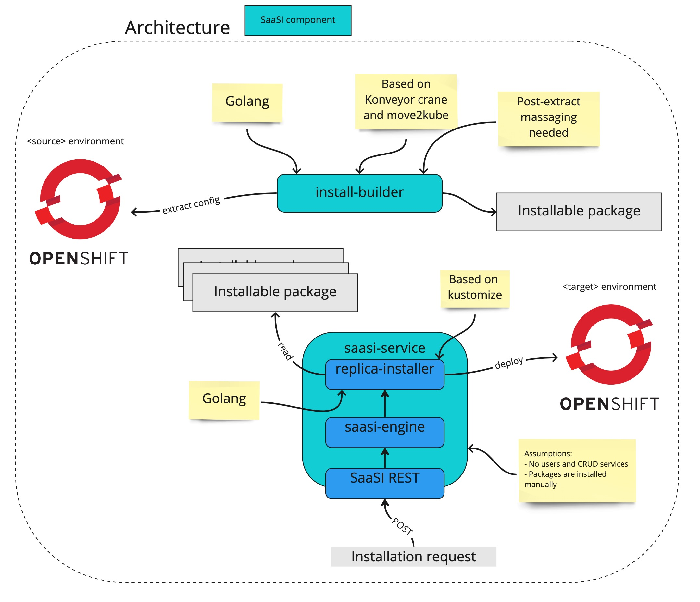

# SaaSi
One Stop shop for hybrid cloud native application packaging and deployment tools

## Software architecture
Composed by two components:
* [replica-builder](./replica-builder/README.md): a tool to replicate an existing OpenShift/Kubernetes environment on 
multiple clusters and namespaces. Consists of two components:
  * [exporter](./replica-builder/exporter/README.md) a Golang CLI tool to extract and manipulate the configured resources
    from a running environment and generate a reusable installer
  * [deployer](./replica-builder/deployer/README.md) a Golang CLI tool to replicate the initial environment on different
    clusters and namespaces
* [saas-engine](./saas-engine/README.md): TBD
  * Uses the [deployer](./replica-builder/deployer) tool defined in the `replica-builder` product

## ADRs placeholders
- reasons to select Konveyor tools
  - collateral goal is to extend the tools with custom transformers for our need
- reasons to use Golang with Konveyor tools script
  - future goal is to convert it to full Golang app
- extraction of ConfigMap keys
  - how they simplify the customization of selected properties 
- all SaasI components should expose API
  - during the first phases some SaasI components might be triggerd from CLI however the CLI will call an API exposed by the SaaSi components  
  - future goal is to turn SaaSi components to services 
